<div align="center"></div>

<p align="center">
	<a href="https://www.python.org">
		
	</a>
	<a href="https://github.com/PySimpleGUI/PySimpleGUI.git">
		
	</a>
    <a href="https://github.com/LambolAlee/PasTk/actions/workflows/python-app-Windows.yml">
		
	</a>
    <a href="https://raw.githubusercontent.com/LambolAlee/PasTk/main/LICENSE">
		
	</a>
    
</p>
<p align=center>
    <b>English</b> | <a href="README_zh.md">中文</a>
    <br/>
	A continuous-copy app, following the 连续复制5.0 program on Quicker on Windows
    <br/>
    <b>By Lambol.Michael.Alee</b>
</p>

## Table of Contents

- [Introduction](#introduction)
- [Install](#install)
    - [Windows User](#windows-user)
    - [macOS User](#macos-user)
        <br/>&emsp;&emsp;[LaunchBar for Example](#launchbar-for-example)
    - [Linux User](#linux-user)
- [Build](#build)
    - [Build From Source](#build-from-source)
- [Usage](#usage)
    - [Tutorial](#tutorial)
    - [Copy Continuously](#copy-continuously)
    - [Manage Copied Contents](#manage-copied-contents)
    - [Settings Panel](#settings-panel)
    - [Multi-Paste Mode](#multi-paste-mode)
- [Thanks](#thanks)
- [Links](#links)
- [License](#license)

## Introduction

At the beginning, I migrate all my workflow to MacBook pro this year. For I am a medical student, I need a convenient tool to help to copy and paste a lot of things to my study notes. I used[ quicker](https://getquicker.net) before when I was on Windows. But after moving to macOS, I find that there is no tools like that in Windows (may be just because I didn't find). Though there are excellent apps like [Paste](https://pasteapp.io) (AWESOME APP <3) which can copy different types of contents into temp clipboard and also support stack-paste mode, multi-paste modes matter. So I want to write one myself. So comes the PasTk.

## Install

(The project has not release the first beta version up to now)

### Windows User

 [](https://github.com/LambolAlee/PasTk/actions/workflows/python-app-Windows.yml)

This project has deployed [Github Action](https://github.com/LambolAlee/PasTk/actions/workflows/python-app-Windows.yml), you can download the new generated file there in artifact.

### macOS User
<p>
	<a href="https://github.com/LambolAlee/PasTk/actions/workflows/python-app-macOS.yml">
		
	</a>
	
</p>

(*There is a puzzling problem I met when packaging the program, for detail you can see this [issue]()*)

**For now**, there is another method which is even more convenient comparing to double clickcing the .app file. You can download the source code directly and deploy it to your launch app such as [LaunchBar](https://www.obdev.at/products/launchbar/index.html) or [Alfred](https://www.alfredapp.com) or any other apps with similar functions.

#### LaunchBar for Example

- **Step 1**

  Tap <kbd>command</kbd> + <kbd>space</kbd> together to wake the LaunchBar up and enter AE(action editor) into the search area to open the action editor

  

- **Step 2**

  Add a new action by clicking the add button in the left bottom corner

  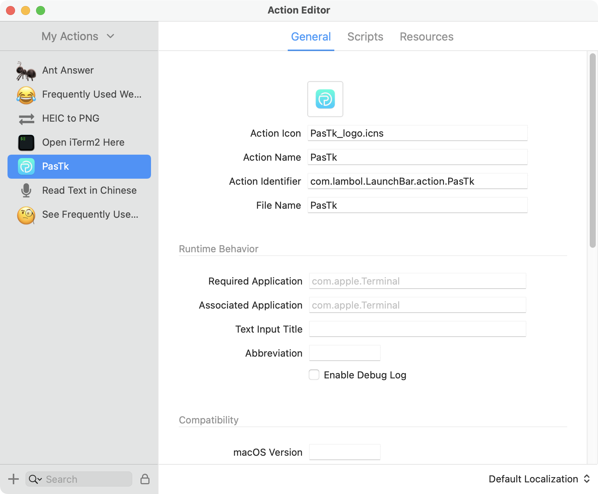

- **Step 3**

  Fill the action icon and name(**necessary** such as PasTk) or the other infomation you want into the form

  *icon shown above is available [here](https://github.com/LambolAlee/PasTk/tree/main/resources/logo)*

- **Step 4**

  1. Switch to the "Scripts" tab and change the programming language to Python and modified the file name with "main.py"

  2. As for options below, only keep run in background on

  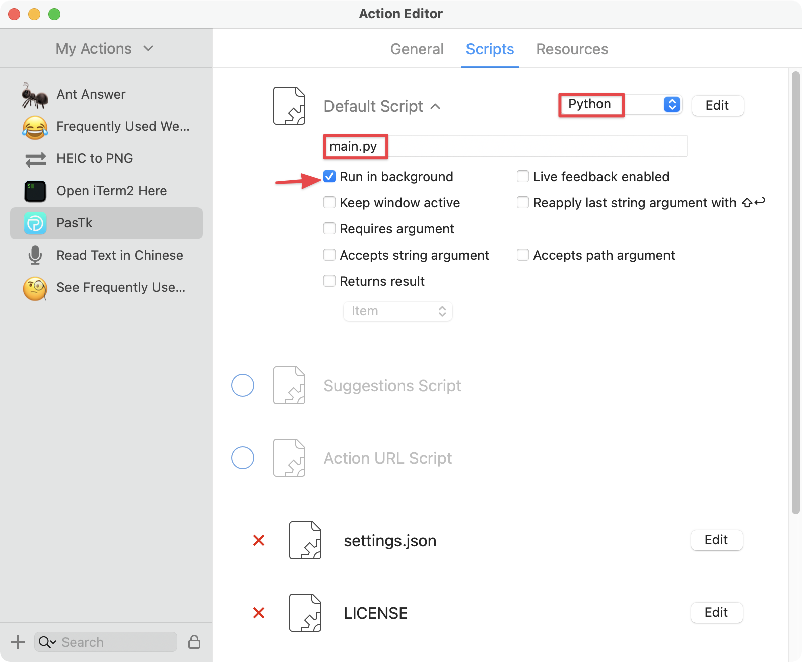

- **Step 5**

  1. Right click the new generated action in the right list and select "show in finder"

     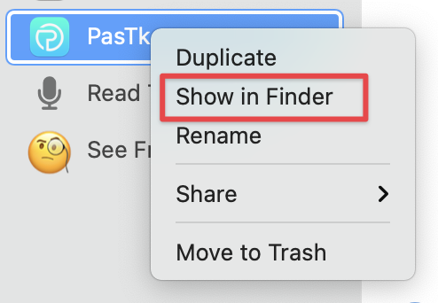

  2. Right click the "PasTk.lbaction" shown in finder and select "show package contents"

     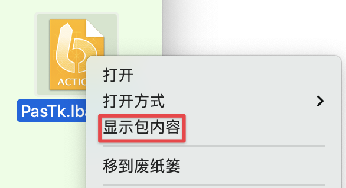

- **Step 6**

  Move the source code into the `PasTk.lbaction/Contents/Scripts` folder and icon file into the `PasTk.lbaction/Contents/Resources` folder

  ***IMPORTANT:***  *LaunchBar will call system Python automaticlly so you may need to add shebang string to the top of main.py to specify the Python interpreter*

  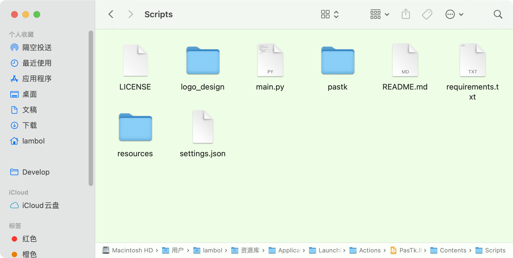

- **Step 7**

  Now you can use the app by tapping <kbd>ptk</kbd> into the launchbar:+1: (Of course you can assign shortcut to the action)

  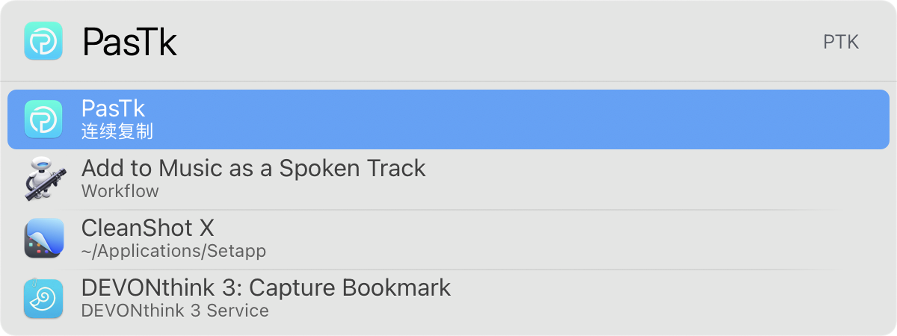

### Linux User


I don't have a Linux computer and I haven't used Linux system for a long time. May be support later.:pray:

## Build

### Build From Source

Clone this repository:

```bash
git clone https://github.com/LambolAlee/PasTk.git
```

Install requirements:

```bash
pip install -r requirements.txt
```

Run the app:

```bash
python main.py
```

## Usage

### Tutorial

1. First launch the app and tap start button

2. Copy whatever text you like by shortcuts or any other means

3. Click over button to select a paste mode fit your needs

4. **<u>*IMPORTANT:*</u>** Click the place you want to paste in before go ahead

5. Select the paste mode and paste 

   *If app doesn't execute auto-paste, you can stiill paste yourself for the content has already written into your clipboard*

6. Congratulations🎉

### Copy Continuously

You can copy continuously and the content will be gethered together for later use


Interface introduction:

- :one: number of contents copied
- :two: detail page that you can manage all the contents copied
- :three: settings panel
- :four: start or over button
- :five: reset button

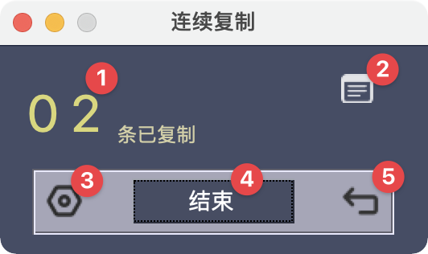

### Manage Copied Contents

Click right top button to enter the contents management page

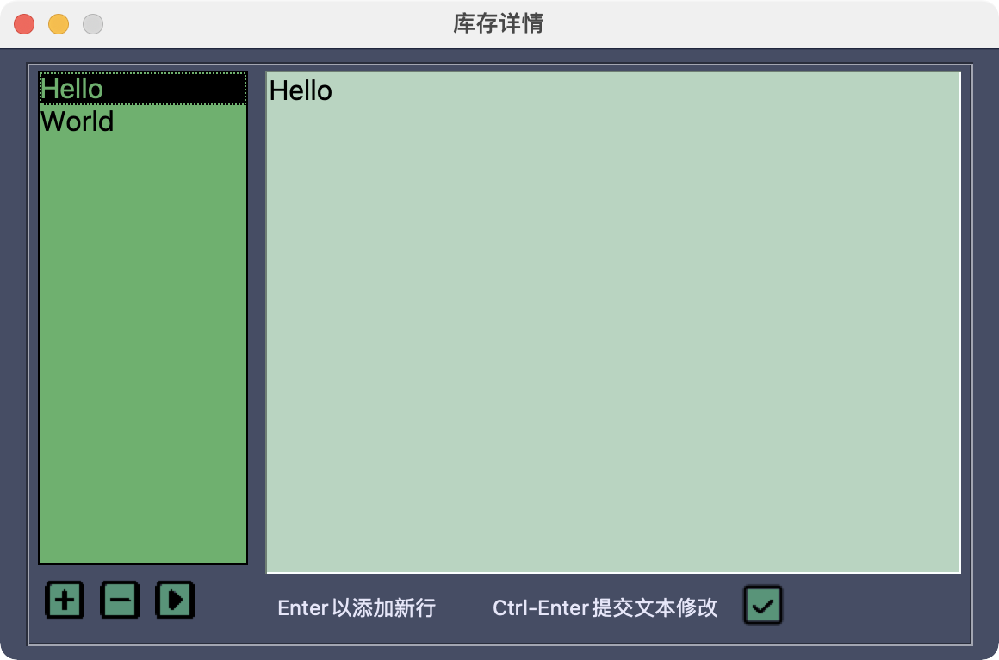

In the page you can:

- Add or remove the contents you copied
- Modify the contents directly in the right side text field

### Settings Panel

There are settings below:

- Manage all the hint music used during copying and pasting

  - launch music: play when the app launch at first time
  - over music: when tap over button and there are contents copied the music will play
  - copy music: play each time you copied a new content

- One-shot mode and persistent mode

  - one-shot mode: once app finishes pasting, it will exit

- There are some musics in the resources directory you can try them via play button or you can add new music into it

  (***only mp3 or wav musics are supported now***)

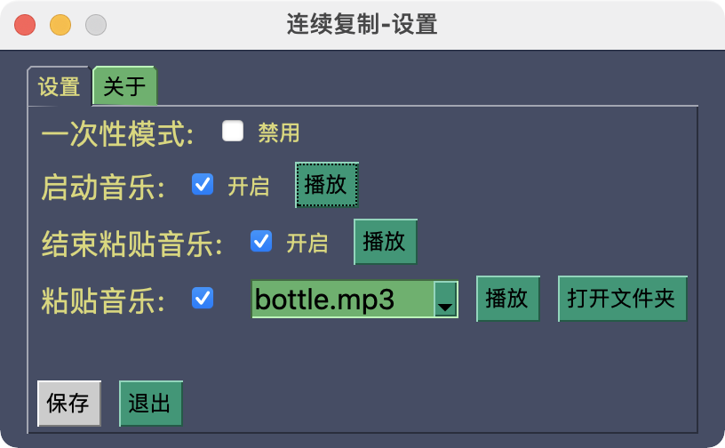

### Multi-Paste Mode

Screenshot of paste-mode selection panel

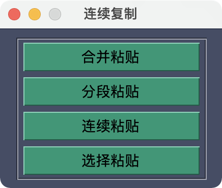


- Merge paste: join all copied contents with a string (*default is ""*)

  

  
- Segmented paste: join all copied contents with Enter (\\n)(*default*) or Tab (\\t)

  

  
- Continuous paste: paste the contents one by one (FIFO) and only paste when you tap next

  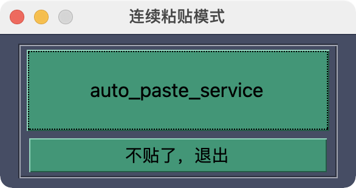

  
- List-selection paste: popup a list contained all the contents, you can select the item whatever you like to paste

  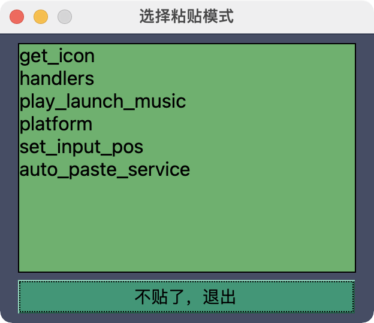

## Thanks

My classmate who made the beautiful [launch music](https://github.com/LambolAlee/PasTk/tree/main/resources/musics/launch) <3

## Links

- [连续复制5.0](https://getquicker.net/Sharedaction?code=a8ead7b7-0dfb-49b8-c1e2-08d6a4fe0b4a)

- [爱给网](https://www.aigei.com/)

- [站长素材网](https://sc.chinaz.com/yinxiao/)

## License

PasTk is licensed under [GPLv3](LICENSE)
